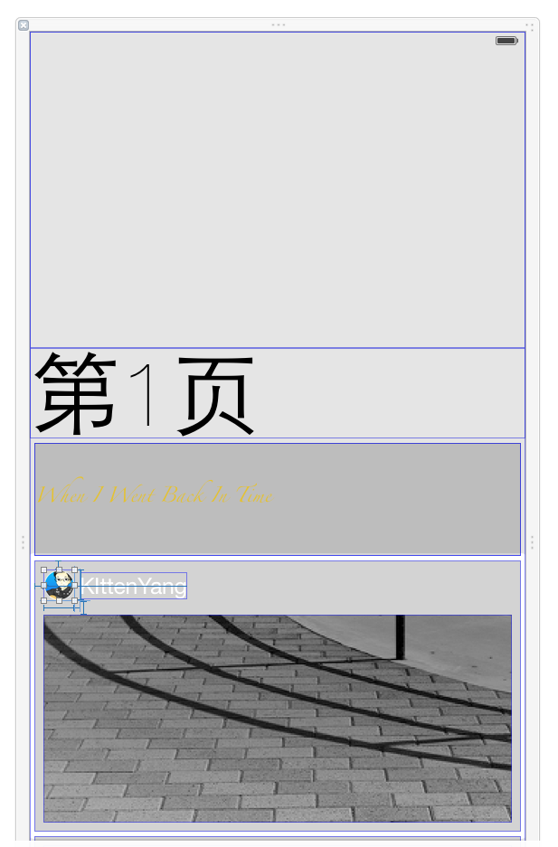

# KYParallaxView

一个

**1.使用简单**

**2.高度自定义**

**3.多种使用方法** 

的视差滚动框架


##本框架有两种使用场景：

##1、如果你不需要使用水平滚动的框架，只需要使用效果图中单页垂直滚动效果，那么你只需在你的ViewController中：
```objective-c
    KYParallaxVerticalView *parallaxVerticalView= [[KYParallaxVerticalView alloc]initWithFrame:self.view.frame];
    [self.view addSubview:parallaxVerticalView];
    [parallaxVerticalView bkgImageViewSetImage: [UIImage imageNamed:@"bkgImg@2x.jpg"]];// 指定背景图

```
就可以了。

##如何自定义单页垂直滚动视图？

进入`CustomViews.h`,你会发现有三个文件


你会发现CustomViewXib是这样的：



是的，你可以在这里可视化布局你想要的滚动界面。当然，为了方便自定义内容你还需要把这些视图拖到代码中来：

```objective-c
@property (strong, nonatomic) IBOutlet UILabel *label;
@property (strong, nonatomic) IBOutlet UIView *box1;
@property (strong, nonatomic) IBOutlet UIView *box2;
@property (strong, nonatomic) IBOutlet UIView *box3;
@property (strong, nonatomic) IBOutlet UIImageView *avatar;
@property (strong, nonatomic) IBOutlet UIImageView *pic;

```

##2、如果你整一个水平滚动的框架，那么你需要在你的ViewController中：
```objective-c
  KYParallaxHorizontalView *parallaxHorizontalView = [[KYParallaxHorizontalView alloc]initWithFrame:self.view.frame andCollectionDelegate:self];
  [self.view addSubview:self.parallaxHorizontalView];

```

然后实现UICollectionDataSource的协议方法：

```objective-c
#pragma mark -- UICollectionDataSource
- (NSInteger)collectionView:(UICollectionView *)collectionView numberOfItemsInSection:(NSInteger)section{
    
    return 5;
    
}

- (UICollectionViewCell *)collectionView:(UICollectionView *)collectionView cellForItemAtIndexPath:(NSIndexPath *)indexPath{
    
    KYParallaxCollectionCell *cell = (KYParallaxCollectionCell *)[collectionView dequeueReusableCellWithReuseIdentifier:@"HorizontalParallexCell" forIndexPath:indexPath];
    cell.verticalView.customView.label.text = [NSString stringWithFormat:@"第%ld页",(long)indexPath.item+1];
    cell.verticalView.customView.avatar.image = [UIImage imageNamed:[NSString stringWithFormat:@"kitten_%ld",(long)indexPath.item+1]];
    cell.verticalView.customView.pic.image = [UIImage imageNamed:[NSString stringWithFormat:@"l%ld.jpg",indexPath.item+1]];
    cell.verticalView.scroller.contentOffset = CGPointMake(0, 0); //解决cell同时复用scrollview位置的bug
    
    //...自定义cell视图
    
    return cell;
    
}
`
```

最后你还需要实现UITableViewDelegate中的scrollViewDidScroll方法：
```objective-c
#pragma mark -- UITableViewDelegate
- (void)scrollViewDidScroll:(UIScrollView *)scrollView{
    [self.parallaxHorizontalView parallax:scrollView];
}
```


